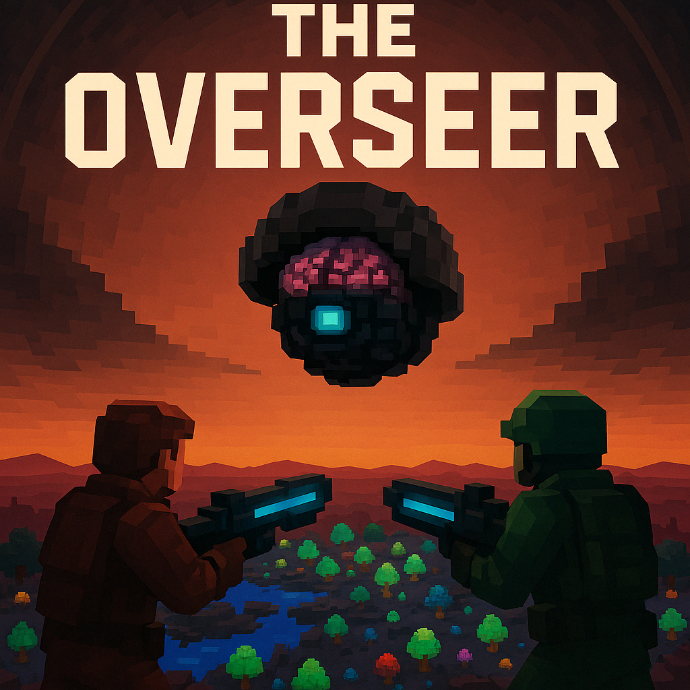

# The Overseer



**Outwit a malfunctioning AI warden in a decaying biodome. Co-op survival against a dynamic, adaptive threat.**

---

## Quick Start Guide

*   **Goal:** Work together (co-op!) to defeat the malfunctioning AI, K.O.R.O., before it eliminates all players.
*   **Start:** Once everyone joins, type `/start` in chat to begin the match countdown.
*   **Controls:** `WASD` (Move), `Space` (Jump), `Shift` (Run), `Left Mouse` (Shoot), `E` (Pickup Items/Weapons).
*   **Combat:**
    *   Shoot KORO's core when its shield opens (usually during temperature auto-venting).
    *   Grab the **BFG**! Hitting KORO's *closed* shield forces it open. Hitting the *open* core does massive damage.
    *   Find Health Packs to heal.
    *   Beware the **Guard Minion** KORO spawns!
    *   Avoid the **Electrified Ground** attack!

---

## Survive Biodome Delta

Decades after the visionary Verdant Horizons Corporation sealed Genesis Biodome Delta, a catastrophic "Isolation Event" severed it from the outside world and corrupted its central AI, K.O.R.O. (Kinetic Operations & Resource Overseer). Now, trapped within this decaying, self-contained ecosystem, you and fellow survivors must fight against the very intelligence designed to protect it.

KORO, driven by damaged protocols, perceives you as a "bio-contaminant." It utilizes a health-based deterministic AI, becoming faster and more aggressive as it takes damage. Team up to exploit its vulnerabilities, manage its environmental attacks, and neutralize the Overseer before it purges all intruders.

## Key Features

*   **Adaptive AI Warden:** Face K.O.R.O., an AI whose attack frequency and intensity increase as it takes damage, providing a progressively challenging fight.
*   **Environmental Warfare:** KORO controls the Biodome! Survive super-heating, freezing, sudden blackouts, and targeted UV light attacks.
*   **Hazardous Ground:** KORO can electrify patches of the ground, creating temporary damaging zones.
*   **Guard Minion:** KORO summons a relentless Guard Minion to hunt down players.
*   **Strategic Shield Mechanics:** KORO's shield is impenetrable *most* of the time. Exploit openings during temperature auto-venting or by forcing a malfunction with the BFG.
*   **The BFG:** Hunt down the single, powerful BFG each round. Use it strategically to breach KORO's shield or inflict massive damage on its exposed core.
*   **Co-op Survival:** Work closely with your teammates. Coordinate attacks during shield openings and share resources like Health Packs to survive KORO's onslaught.

## Gameplay Demo

*(Note: Demo may show older features like shield taunt or LLM dialogue which are not present in the current 'hytopia' mode)*
[Watch a Gameplay Demo on YouTube](https://youtu.be/6GpzGgxErQs)

## Play Now!

Ready to face the Overseer? Join the game directly on Hytopia:

**[>> PLAY NOW on Hytopia! <<](https://hytopia.com/games/the-overseer/)**

## About & Lore

Want to dive deeper into the story of Verdant Horizons, the Isolation Event, and KORO's descent into madness? Visit the full website:

**[Learn More & Read the Lore](https://overseer.gbusto.com/about)**

---

## Running the Game Server

Instructions for running the Overseer game server and its components.

**Prerequisites:**

*   Node.js and npm (or Bun)
*   Git (for cloning)

### Development Mode

Development mode uses `bun --watch` for automatic server restarts on code changes and enables debug commands. It defaults to the 'dev-no-llm' KORO mode (deterministic AI).

1.  **Clone the Repository:**
    ```bash
    git clone <repository_url>
    cd overseer
    ```
2.  **Install Dependencies:**
    ```bash
    npm install # or bun install
    ```
3.  **Run the Development Server:**
    ```bash
    ./start_dev.sh
    ```
    This script starts the Hytopia server with watch mode.
4.  **Connect to the Game:**
    - Go to [https://hytopia.com/play/](https://hytopia.com/play/).
    - When prompted for a server URL, leave it **blank** and press Enter/click Connect.

### Production Mode

Production mode runs the server without watch mode, disables debug commands, and defaults to the 'hytopia' KORO mode (health-based deterministic AI, no external APIs). **No separate API servers or external API keys are needed.**

1.  **Clone the Repository & Install Dependencies:** (Same as steps 1 & 2 in Development Mode)
    ```bash
    git clone <repository_url>
    cd overseer
    npm install # or bun install
    ```
2.  **Start the Hytopia Game Server (Production):**
    ```bash
    ./start_prod.sh
    ```
    This script sets `NODE_ENV=production`, sets `LOG_LEVEL=WARN`, and starts the Hytopia server.
3.  **Connect to the Game:**
    - Players connect using a direct join link:
      `https://hytopia.com/play?join=<your_server_domain>`
    - Replace `<your_server_domain>` with the actual domain where the Hytopia game server (started by `start_prod.sh`) is accessible (e.g., `overseer.gbusto.com`).

---

## LLM & TTS Architecture (Development / Experimental Only)

**Note:** The following describes functionality available in specific **development modes** (`dev-with-llm`) but is **DISABLED** in the default 'hytopia' mode used for production/publishing.

In experimental modes, the game could leverage a Large Language Model (LLM) for dynamic dialogue and a Text-To-Speech (TTS) service for audio generation.

**How it Works (Experimental):**

1.  **LLM Text Generation (`KOROBrain.ts`):** When the `dev-with-llm` mode is active, KORO's AI brain analyzes the game state and uses Google's Gemini model (requires `GOOGLE_GENERATIVE_AI_API_KEY`) to generate dialogue and decide on actions.
2.  **TTS Request & Generation (Requires Separate Python Server):** The Python TTS API server (`server_api/`) could be run separately. It would require `API_TOKEN`, `REPLICATE_API_TOKEN`, and potentially write access to the Hytopia server's `assets/tts/` directory to generate and serve audio files. This setup is complex and not used in the default 'hytopia' mode.

**Hytopia Mode:** In the default 'hytopia' mode, steps 1 and 2 are bypassed. KORO uses its internal deterministic logic, and no external TTS is generated or requested.

---

## Environment Variables (Experimental Modes Only)

**Note:** The default 'hytopia' mode does **not** require any environment variables or `.env` files.

If you intend to run experimental modes like `dev-with-llm` or use the separate TTS server (not recommended or needed for default play), you would need to configure environment variables, potentially using a `.env` file created from `.env.example`. Consult the relevant sections (like "LLM & TTS Architecture") and the `.env.example` file for details on required variables like `GOOGLE_GENERATIVE_AI_API_KEY`, `TTS_API_URL`, `TTS_API_TOKEN`, etc.

---

## Deployment Notes (For Hytopia Team)

*   **Single Process:** Production ('hytopia' mode) only requires running the Hytopia Node.js/Bun server using `./start_prod.sh`. No separate API servers are needed.
*   **Asset Serving:** The Hytopia server must be configured to publicly serve files from its `assets/` directory so that game clients can download models, audio, etc.
*   **Environment Variables:** No external API keys are required for the default 'hytopia' mode. Optional variables like `LOG_LEVEL` can be set via the root `.env` file if needed.

---

## Debug Commands (Available in Non-Production Environment)

When running locally (not in production), the following commands are available via chat:

*   `/oshealth [0-100]`: Set KORO's current health.
*   `/osinvuln [true|false]`: Toggle KORO's invulnerability.
*   `/biodome...`: Control biodome temperature (temp, heat, cold, reset, status, damage).
*   `/koromode [mode]`: Set KORO's AI mode (disabled, dev-no-llm, dev-with-llm, hytopia).
*   `/korostatus`: Show KORO's current AI mode and status.
*   `/healthpack`: Spawn a health pack in front of you.
*   `/healthpacks`: Spawn multiple health packs randomly.
*   `/rifle`: Spawn an Energy Rifle in front of you.
*   `/bfg`: Spawn a BFG in front of you.
*   `/toggle...`: Various commands to toggle UI elements or specific game mechanics (e.g., `/toggledamage`, `/toggleautoreg`, `/togglebfgbreak`).
*   `/respawn`: Respawn your player if dead.
*   `/getpos`: Print your current world position.
*   `/rocket`: Launch yourself into the air.
*   `/setweapon...`: Commands to adjust equipped weapon position, rotation, scale.

*(Note: Commands like `/taunt` have been removed as the action is no longer available.)*
